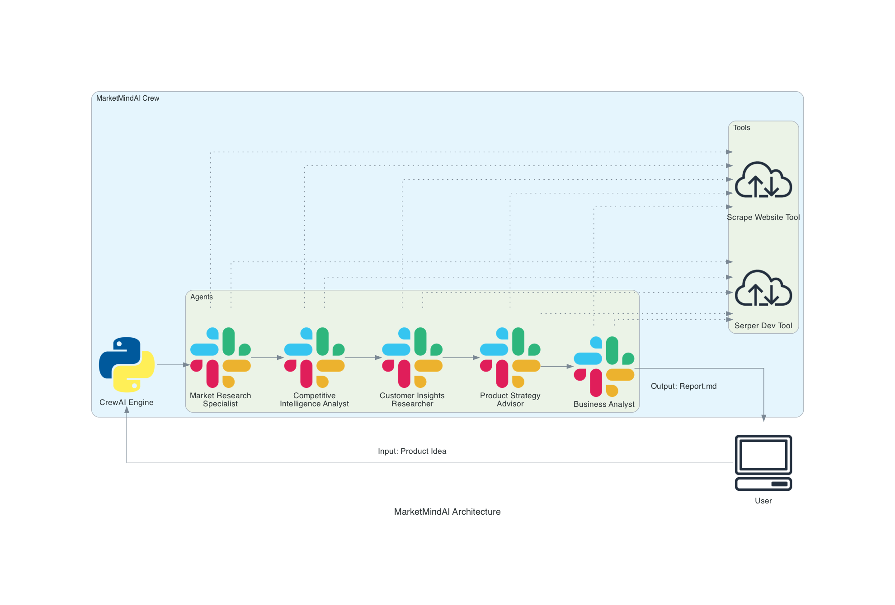

# MarketMindAI 🧠

**AI-Powered Market Research Crew**

MarketMindAI is an intelligent agent team designed to conduct comprehensive market research, competitive analysis, and strategic planning. Built with [CrewAI](https://crewai.com), it orchestrates a team of specialized AI agents to deliver actionable business insights from a single product idea.

## 🏗️ Architecture



The system employs a sequential process where agents collaborate to build a complete business report:

1.  **Market Research Specialist**: Analyzes market size, growth trends, and regulatory landscape.
2.  **Competitive Intelligence Analyst**: Identifies competitors, their strengths/weaknesses, and market positioning.
3.  **Customer Insights Researcher**: Defines target personas, pain points, and customer segments.
4.  **Product Strategy Advisor**: Develops MVP features, differentiation strategy, and roadmaps.
5.  **Business Analyst**: Synthesizes all findings into a final investment-grade business report.

## 🚀 Features

-   **Deep Market Analysis**: TAM/SAM/SOM calculations and trend forecasting.
-   **Competitor Deep Dives**: Detailed analysis of direct and indirect competitors.
-   **Customer Persona Generation**: Data-driven customer profiles and journey mapping.
-   **Strategic Roadmap**: actionable product strategy and feature prioritization.
-   **Investment Memo Generation**: Professional business report ready for stakeholders.
-   **Live Web Research**: Uses Serper Dev API for real-time data access.

## 🛠️ Prerequisites

-   **Python 3.10+**
-   **uv** (recommended) or pip
-   **OpenAI API Key** (for the LLM)
-   **Serper API Key** (for Google Search capabilities)

## 📦 Installation

1.  **Clone the repository:**
    ```bash
    git clone https://github.com/sahilk710/MarketMindAI-.git
    cd market_research_crew
    ```

2.  **Install dependencies:**
    ```bash
    uv sync
    # OR
    pip install .
    ```

3.  **Set up environment variables:**
    Create a `.env` file in the root directory:
    ```env
    OPENAI_API_KEY=sk-...
    SERPER_API_KEY=...
    MODEL=gpt-4.1-mini-2025-04-14  # Optional, defaults to gpt-4
    ```

## 🏃 Usage

Run the crew with a single command:

```bash
crewai run
```

By default, the crew will research the topic defined in `src/market_research_crew/main.py`. You can modify the `inputs` dictionary in `main.py` to change the product idea:

```python
inputs = {
    'product_idea': 'An AI-powered tool that helps summarizes youtube videos...',
    'current_year': str(datetime.now().year)
}
```

## 📄 Output

The final report will be saved as `report.md` in the root directory.

## 🤝 Contributing

Contributions are welcome! Please feel free to submit a Pull Request.
